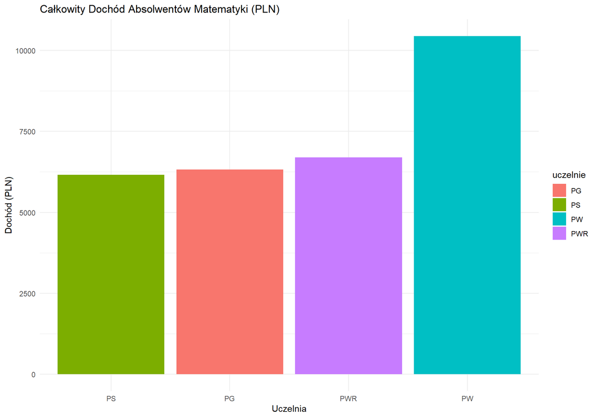
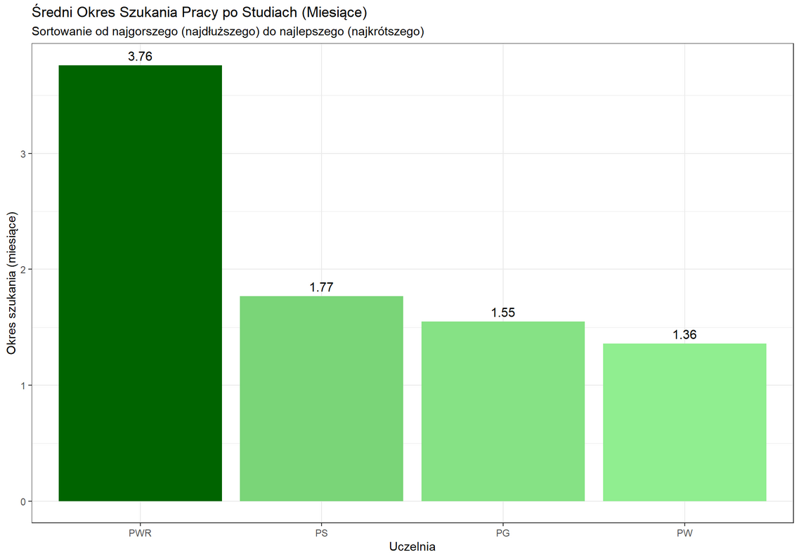
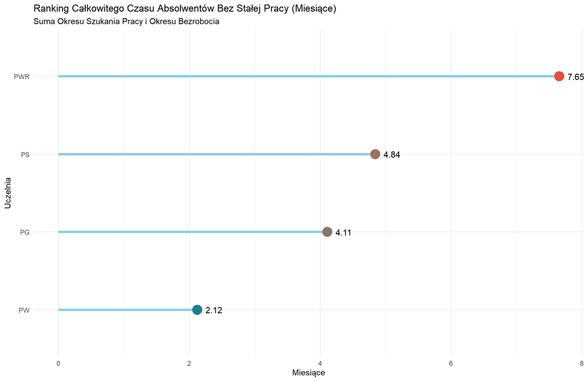
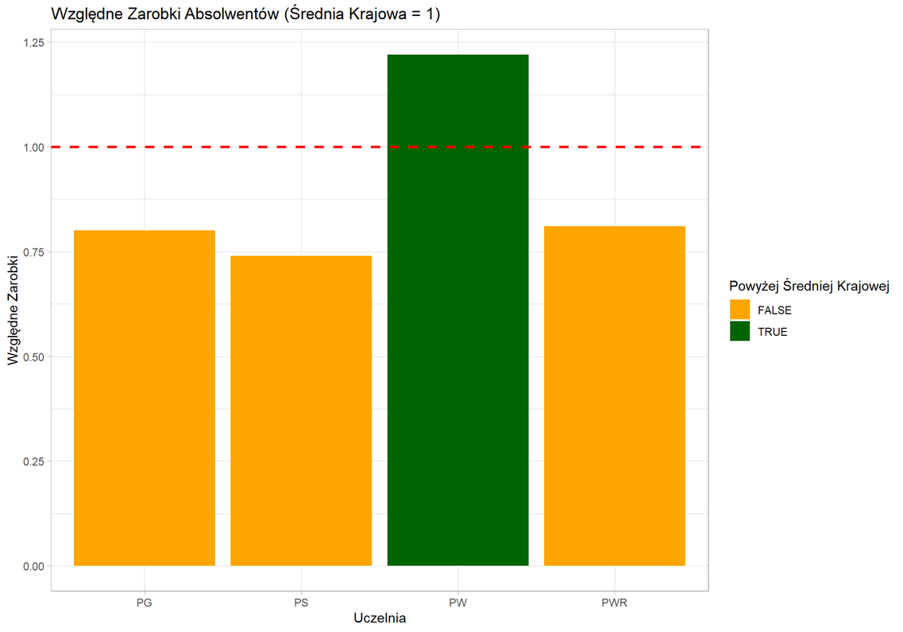
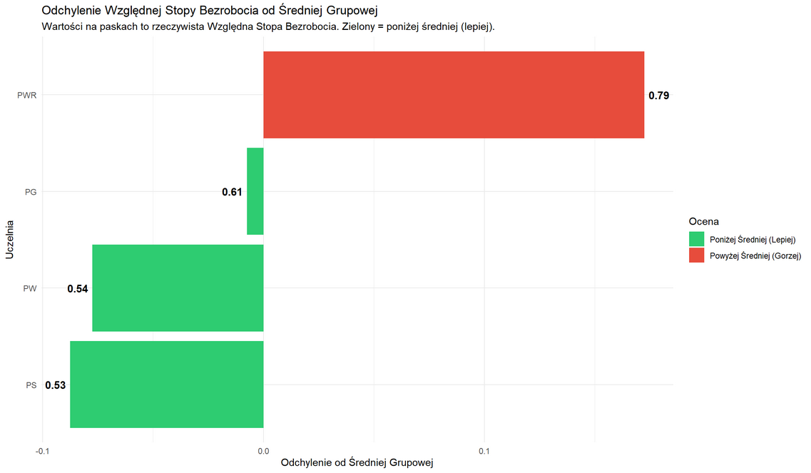

# 📈 Losy i Kariera Absolwentów Matematyki

## 💬 O projekcie
Projekt zrealizowany w języku R w ramach pracy zespołowej na studiach. Projekt odpowiada na pytania:
1. **Absolwenci której uczelni najszybciej znajdują pracę?**
2. **Absolwenci której uczelni mają największe zarobki?**
3. **Absolwenci której uczelni mają największy problem ze znalezieniem pracy?**
4. **Czy absolwenci wszystkich uczelni zarabiają powyżej średniej krajowej?**

## 🛠️ Zrealizowane kroki:
* Zgromadzenie zbioru danych
* Wyczyszczenie zbioru
* Zbadanie braków danych
* Filtrowanie i sortowanie
* Stworzenie statystyk wizualnych

## 📸 Podgląd wykresów

### Zarobki:

### Okres szukania pracy:

### Okres bezrobocia:

### Porównanie ze średnią krajową:

### Wpływ stopy bezrobocia na zarobki:
